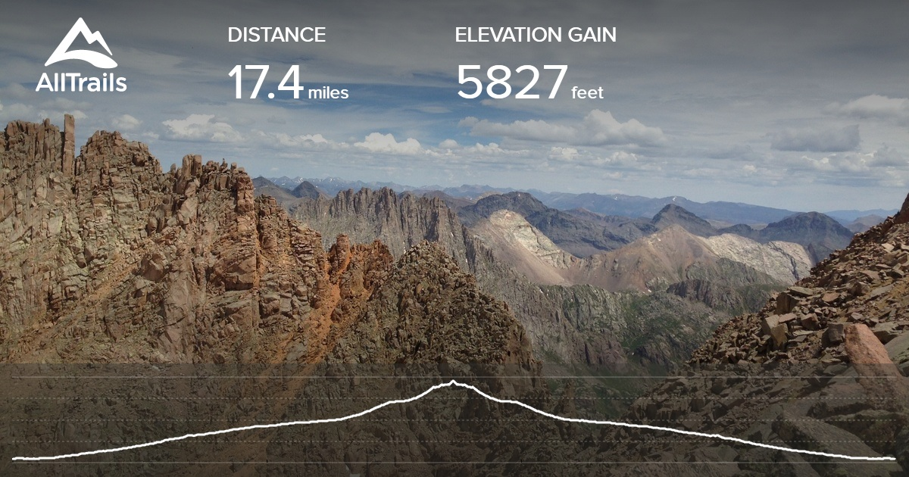
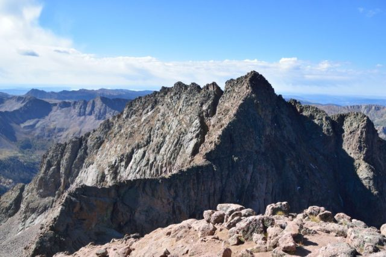
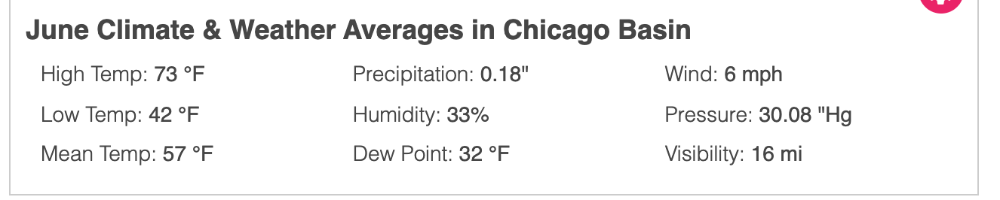
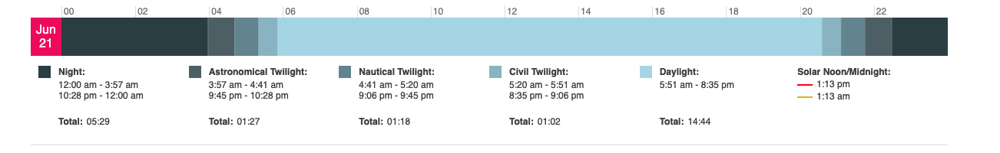
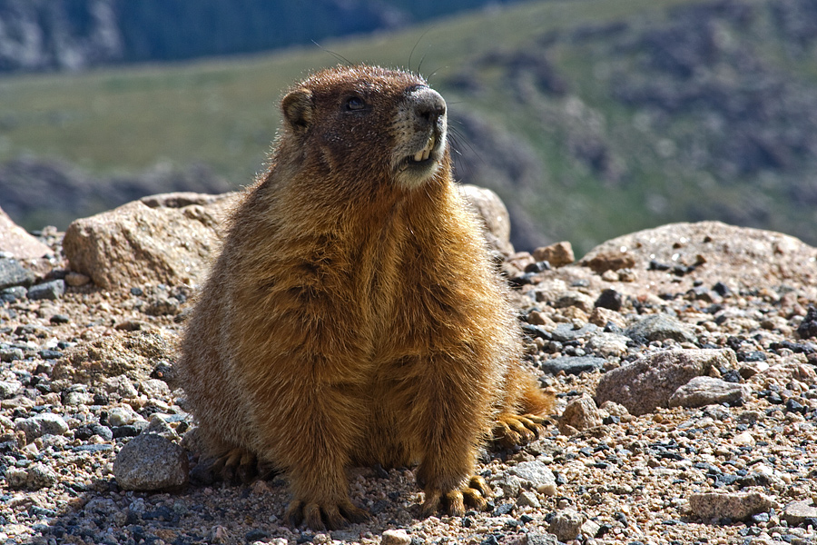
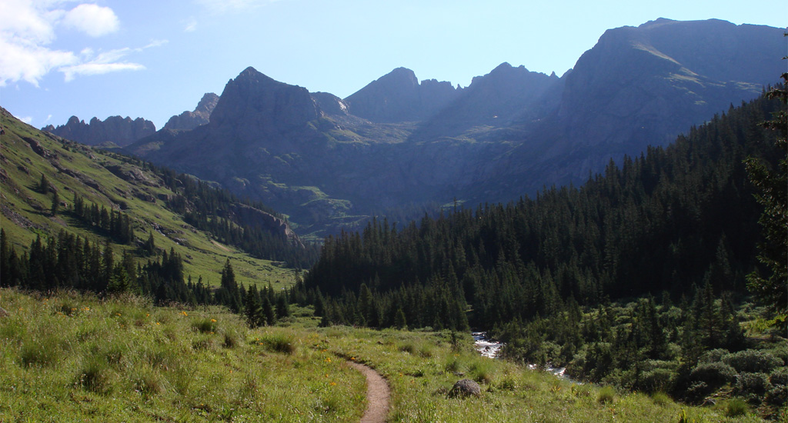

# Mt Eolus from Chicago Basin

## Description

The trail head (8200 ft) is accessible using the Durango-Silverton narrow gauge train.  We board at 0845.  We get let off the train in Needleton at 1115.  From there it's a ~6 mile hike along Needle Creek to camp in Chicago Basin (11200 ft), just south of Twin Lakes.  It's likely that there will still be time left in the day so there is an optional trip up to columbine pass (12665 ft) to the south east.

On day two we will climb up to Twin Lakes (12500 ft) and anyone not climbing to the top of Mt Eolus will be able to sit by the lakes and read a book.  Then we head west and climb up to North Eolus (14039 ft, unranked) from there we move on to Mt Eolus (14085, 33 of 53).  Then descend the way we came back to Twin Lakes and Chicago Basin.

On day three we make our way back out of Chicago Basin to the rail line.  We flag down the train at 1530 (there is no platform, this is a 'flagstop').  We drink a beer on the train and spend a short weekend in Durango with family.

## Dates

We're flexible but looking at being in Durango on June 23, hiking the 24th,25th,and 26th.  Wives and babies will hopefully be in Durango/Silverton early on the 26th and be on the train that picks us up.

## Climbing

*Eolus from N. Eolus.*

Mt Eolus is mostly a class 2 with some class 3 stuff.  While it's a scramble to get to the summit and you will need to use some handholds, it's far from rock climbing.  A helmet would probably be recommended but probably unused.  Rope will not be needed.  Depending on the weather in the weeks before the trip crampons might be nice to have.

## Getting there.

*This is our ride*

We will leave Denver on the 23rd for a ~6.5 hour drive to Durango.  After spending the night in Durango we'll get the train to Silverton and be dropped off at the trail head.  

## Permits and Restrictions

There are currently no recreation permits required for public use of the San Juan National Forest. This includes the Weminuche, Lizard Head and South San Juan Wilderness areas, Chicago Basin, and all other special designation areas.

Camping is not allowed in Twin Lakes Basin (north of Chicago Basin). This includes the entire area bounded by the three 14ers

Fires are not permitted, use stoves.

LNT

## Weather

## Critters

Marmots and mountain goats.  Marmots get into everything and will gnaw at your trekking pole handles to get the salt.  Food should be hung from trees.  Bears are not a concern but because food is hung we'll be covered if some bear makes it that far southeast.  The mountain goats are pretty used to humans and you'll get close enough for some pretty cool pictures.

## Summery

This is a weird one.  It's short, no day greater than 7 miles but there is a lot of elevation gain even without Mt Eolus.  To get to the trail head you need a ticket for an historic train and the opportunity to bag my first 14er is too much to resist.

